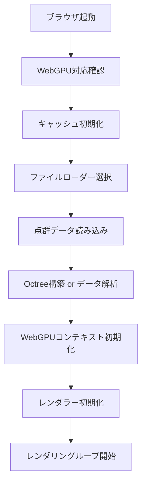

# DEBUG-WebGPU-Analyzer

高性能な点群データ可視化フレームワーク。WebGPUとWGSLを使用したアウトオブコアレンダリングにより、大規模な3D点群データをブラウザ上でリアルタイムに表示します。

[](https://opensource.org/licenses/ISC)
[](https://www.typescriptlang.org/)
[](https://www.w3.org/TR/webgpu/)

---

## 📋 目次

- [特徴](#-特徴)
- [対応フォーマット](#-対応フォーマット)
- [前提条件](#-前提条件)
- [インストール](#-インストール)
- [使い方](#-使い方)
- [技術スタック](#-技術スタック)
- [プロジェクト構造](#-プロジェクト構造)
- [システムフロー](#-システムフロー)
- [主要機能](#-主要機能)
- [開発](#-開発)
- [トラブルシューティング](#-トラブルシューティング)
- [ドキュメント](#-ドキュメント)
- [ライセンス](#-ライセンス)

---

## ✨ 特徴

- **🚀 WebGPUベースの高速レンダリング** - 最新のGPU APIを活用した並列処理
- **📦 アウトオブコアレンダリング** - メモリに収まらない大規模データを効率的に処理
- **🎨 4種類のカラーマップ** - RGB、X軸、Y軸、Z軸による可視化
- **🗂️ 多様なフォーマット対応** - COPC、LAS、LAZ、XYZ、TIF/TIFF
- **🌲 Octree空間分割** - 効率的な階層的データ管理
- **💾 多層キャッシュシステム** - LRUキャッシュ + 永続化キャッシュ
- **⚡ Web Workerによる並列処理** - UIをブロックしないデータ取得
- **📊 リアルタイム統計表示** - ノード数、キャッシュヒット率など

---

## 📁 対応フォーマット

| フォーマット | 拡張子 | 説明 | 特徴 |
|------------|--------|------|------|
| **COPC** | `.copc.laz` | Cloud Optimized Point Cloud | ストリーミング対応、階層的データ構造 |
| **LAS** | `.las` | LASer file format | 非圧縮の標準点群フォーマット |
| **LAZ** | `.laz` | LASzip compressed | 圧縮版LAS、ファイルサイズ小 |
| **XYZ** | `.xyz` | ASCII point cloud | テキスト形式、シンプル |
| **TIF/TIFF** | `.tif`, `.tiff` | GeoTIFF | ラスターデータから点群に変換 |

---

## 🔧 前提条件

### ブラウザ要件

WebGPUをサポートするブラウザが必要です：

- **Chrome/Edge**: 113以降
- **Firefox**: Nightly版（experimental）
- **Safari**: Technology Preview（experimental）

WebGPU対応状況の確認:
```javascript
if (!navigator.gpu) {
  console.error("WebGPU is not supported in this browser");
}
```

### 開発環境

- **Node.js**: 16.x 以降
- **npm**: 7.x 以降
- **TypeScript**: 5.9.3

---

## 📥 インストール

### 1. リポジトリのクローン

```bash
git clone <repo>
cd repo
```

### 2. 依存関係のインストール

```bash
npm install
```

### 3. データセットの配置（オプション）

点群データを `dataset/` ディレクトリに配置します：

```
dataset/
├── las/       # LASファイル
├── laz/       # LAZファイル
├── xyz/       # XYZファイル
└── tif/       # TIF/TIFFファイル
```

---

## 🚀 使い方

### 開発サーバーの起動

```bash
npm run dev
```

ブラウザで `http://localhost:8080` を開きます。

### プロダクションビルド

```bash
npm run build
```

ビルド成果物は `public/` ディレクトリに出力されます。

### データの読み込み

`src/index.ts` でロードするファイルを指定します：

```typescript
async function _initializeFileData() {
  // 使用したいローダーをコメント解除
  // const { filename, vectorType } = _copc_file_loader();
  // const { filename, vectorType } = _las_file_loader();
  const { filename, vectorType } = _laz_file_loader();  // ← アクティブ
  // const { filename, vectorType } = _xyz_file_loader();
  // const { filename, vectorType } = _tif_file_loader();

  await initializePointCloud(filename);
  return { filename, vectorType };
}
```

`src/configs.ts` でファイルパスを設定します：

```typescript
export const LAZ_FILES = [
  "dataset/laz/your-file.laz"
];
```

### カラーマップの切り替え

画面右上のセレクトボックスで選択：

- **RGB Color** - 点群データの実際の色
- **Z-axis color map** - 高さに応じた色（青→赤）
- **X-axis color map** - X座標に応じた色
- **Y-axis color map** - Y座標に応じた色

---

## 🛠️ 技術スタック

### コア技術

| 技術 | バージョン | 用途 |
|------|-----------|------|
| **WebGPU** | Latest | GPU計算・レンダリング |
| **WGSL** | - | シェーダー言語 |
| **TypeScript** | 5.9.3 | 型安全な開発 |
| **Webpack** | 5.75.0 | モジュールバンドル |

### 主要ライブラリ

#### レンダリング・数学
- **three.js** (0.148.0) - カメラ制御、行列演算
- **gl-matrix** (3.4.4) - 高速な行列・ベクトル演算

#### 点群データ処理
- **@loaders.gl/las** (4.3.4) - LAS/LAZ読み込み
- **@loaders.gl/geotiff** (4.3.4) - GeoTIFF読み込み
- **copc** (0.0.4) - COPC読み込み
- **laz-perf** (0.0.5) - LAZ圧縮解凍（WASM）

#### キャッシュ・ストレージ
- **lru-cache** (8.0.4) - LRUキャッシュ実装
- **Origin Private File System API** - ブラウザ永続ストレージ

---

## 📂 プロジェクト構造

```
DEBUG-WebGPU-Analyzer/
├── public/                    # 静的ファイル・ビルド成果物
│   ├── index.html            # メインHTML
│   ├── js/                   # 外部JSライブラリ
│   ├── laz-perf.wasm        # LAZ解凍WASM
│   └── bundle.js            # ビルド成果物（Git除外）
├── src/                      # ソースコード
│   ├── cache/               # キャッシュシステム
│   │   ├── lru-cache.ts           # LRUキャッシュ
│   │   ├── persistent-cache.ts    # 永続キャッシュ
│   │   └── node-cache-manager.ts  # ノードキャッシュ管理
│   ├── loaders/             # ファイルローダー
│   │   ├── base-loader.ts         # 基底ローダークラス
│   │   ├── copc-loader.ts         # COPCローダー
│   │   ├── las-loader.ts          # LASローダー
│   │   ├── xyz-loader.ts          # XYZローダー
│   │   ├── tif-loader.ts          # TIFローダー
│   │   └── pointcloud-loader.ts   # ローダーファサード
│   ├── octree/              # Octreeデータ構造
│   │   ├── octree.ts              # Octree実装
│   │   └── octree-traverser.ts    # 視錐台カリング
│   ├── renderers/           # レンダラー
│   │   ├── base-renderer.ts       # 基底レンダラー
│   │   ├── vec3-renderer.ts       # Vec3レンダラー（LAS/XYZ/TIF用）
│   │   ├── vec4-renderer.ts       # Vec4レンダラー（COPC用）
│   │   └── renderer-factory.ts    # ファクトリパターン
│   ├── shaders/             # WGSLシェーダー
│   │   ├── vec3-shader.wgsl       # Vec3シェーダー
│   │   └── vec4-shader.wgsl       # Vec4シェーダー
│   ├── webgpu/              # WebGPUコア
│   │   ├── webgpu-context.ts             # WebGPUコンテキスト
│   │   ├── webgpu-renderer.ts     # レンダリングループ
│   │   ├── webgpu-buffer.ts       # バッファ管理
│   │   ├── uniform-buffer.ts      # ユニフォームバッファ
│   │   └── canvas-event.ts        # イベントハンドリング
│   ├── worker/              # Web Worker
│   │   ├── fetcher.worker.ts      # データ取得Worker
│   │   └── worker-manager.ts      # Workerプール管理
│   ├── views/               # UI・状態管理
│   │   ├── states/               # アプリケーション状態
│   │   └── stats-display/        # 統計表示（Facadeパターン）
│   ├── types/               # TypeScript型定義
│   ├── utils/               # ユーティリティ
│   ├── configs.ts           # 設定ファイル
│   └── index.ts             # エントリーポイント
├── dataset/                 # 点群データ（Git除外）
├── research-memo/           # 調査メモ・ドキュメント（Git除外）
├── laz-converter/           # LAZ変換ツール
├── tests/                   # テストファイル
├── webpack.config.js        # Webpack設定
├── tsconfig.json           # TypeScript設定
└── package.json            # プロジェクト定義
```

---

## 🔄 システムフロー

### 1. 初期化フロー



### 2. レンダリングフロー（COPC例）

```
[ユーザー操作: カメラ移動]
         ↓
[視錐台カリング]
  - カメラの視界内のノードを抽出
         ↓
[ノードキャッシュ解決]
  ├─ GPU Buffer → ヒット（最速）
  ├─ LRU Cache → ヒット（高速）
  ├─ 永続Cache → ヒット（中速）
  └─ 未キャッシュ → Web Workerで取得
         ↓
[Web Worker Pool (最大8個)]
  - COPCファイルからノードデータ取得
  - LAZ解凍（laz-perf WASM）
  - 座標変換・色情報抽出
         ↓
[GPUバッファ作成]
  - Position Buffer (vec4)
  - Color Buffer (vec3)
         ↓
[LRUキャッシュ更新]
  - 最近使用したノードを保持
         ↓
[永続キャッシュ更新]
  - Origin Private File Systemに保存
         ↓
[WebGPUレンダリング]
  - ユニフォームバッファ更新（MVP行列）
  - レンダーパス実行
  - シェーダー実行（頂点・フラグメント）
         ↓
[画面表示]
```

### 3. データフロー図

```
[点群ファイル (COPC/LAS/LAZ/XYZ/TIF)]
         ↓
[PointCloudLoader] ← ファサードパターン
         ↓
    ┌──┴──┬────┬────┬────┐
    │     │    │    │    │
  [COPC][LAS][LAZ][XYZ][TIF]
    │     │    │    │    │
    └──┬──┴────┴────┴────┘
         ↓
[データ解析・変換]
  - 境界ボックス計算
  - スケールファクター
  - 座標正規化
         ↓
[アプリケーション状態更新]
  - appState.copcData
  - appState.lasData
  - appState.xyzData
  - appState.tifData
         ↓
[Octree構築 or 直接バッファ作成]
         ↓
[WebGPURenderer]
  ├─ Uniform Buffer (カメラ、カラーマップ、パラメータ)
  ├─ Position Buffer
  └─ Color Buffer
         ↓
[GPU レンダリング]
```

---

## 🎯 主要機能

### 1. Octree空間分割（COPC用）

**目的**: 大規模点群データを階層的に管理し、必要な部分だけをレンダリング

**実装**: `src/octree/octree.ts`

**特徴**:
- 8分木構造による空間分割
- 視錐台カリング（カメラの視界外は処理しない）
- LOD（Level of Detail）による動的詳細度調整

**設定**:
```typescript
// src/configs.ts
export const LEAF_CAPACITY = 100;    // 1ノードあたりの最大点数
export const BUFFER_CAPACITY = 500;  // バッファ容量
```

### 2. 多層キャッシュシステム

**3層のキャッシュ階層**:

| レベル | 種類 | 速度 | 容量 | 実装 |
|--------|------|------|------|------|
| L1 | GPU Buffer | 最速 | 小 | WebGPU Buffer |
| L2 | LRU Cache | 高速 | 中 | lru-cache (メモリ) |
| L3 | Persistent Cache | 中速 | 大 | Origin Private File System |

**キャッシュヒット率**: 画面左下のステータスに表示

**実装**:
- `src/cache/lru-cache.ts` - LRUキャッシュ
- `src/cache/persistent-cache.ts` - 永続キャッシュ
- `src/cache/node-cache-manager.ts` - キャッシュ解決ロジック

### 3. Web Workerによる並列処理

**目的**: メインスレッドをブロックせずにデータ取得・解凍

**実装**: `src/worker/`

**特徴**:
- 動的Workerプール（最大数 = CPU論理コア数 - 1）
- COPCノードの並列取得
- LAZ解凍（laz-perf WASM）

**フロー**:
```
[Main Thread]
    ↓ (postMessage)
[Worker Pool]
  - COPC HTTPリクエスト
  - LAZ解凍
  - データ変換
    ↓ (postMessage)
[Main Thread]
  - GPUバッファ作成
```

### 4. カラーマップシステム

**4種類の可視化モード**:

1. **RGB Color** (デフォルト)
   - 点群データの実際のRGB値を使用

2. **Z-axis Color Map**
   - 高さに応じたグラデーション
   - 低い位置: 青系 → 高い位置: 赤系

3. **X/Y-axis Color Map**
   - 座標値に応じたグラデーション

**カラーパレット**:
```typescript
// 20色のHSVグラデーション（青→緑→黄→赤）
const hsvColors = [
  [0.0, 0.0, 0.5],  // 暗い青
  [0.0, 0.2, 0.7],  // 青
  // ... 中間色
  [0.9, 0.0, 0.0],  // 赤
];
```

**詳細**: `research-memo/colormap-system-explanation.md`

### 5. レンダリングパイプライン

#### レンダラーアーキテクチャ

プロジェクトでは **抽象化レイヤーパターン** を採用し、異なるファイルフォーマットに対応しながらコードの重複を最小限に抑えています。

```
┌──────────────────────────────┐
│   BaseRenderer (抽象クラス)   │
│   - initialize()             │
│   - render()                 │
│   - abstract getLayout()     │
└──────────────────────────────┘
            ▲
            │
    ┌───────┴──────┐
    │              │
┌───▼────┐    ┌────▼────┐
│ Vec3   │    │  Vec4   │
│Renderer│    │Renderer │
└────────┘    └─────────┘
    ▲              ▲
    │              │
┌───┴────┬────┐    │
│        │    │
LAS     XYZ  TIF  COPC
LAZ
```

**アーキテクチャの利点**:
- **コードの再利用**: 共通処理は基底クラスに集約
- **拡張性**: 新しいフォーマット追加が容易
- **型安全性**: TypeScriptの抽象クラスで保証
- **保守性**: 変更の影響範囲が明確

**実装ファイル**:
- 基底クラス: `src/renderers/base-renderer.ts`
- Vec3: `src/renderers/vec3-renderer.ts`
- Vec4: `src/renderers/vec4-renderer.ts`
- ファクトリ: `src/renderers/renderer-factory.ts`

#### Vec3レンダラー (LAS/LAZ/XYZ/TIF用)

**対応フォーマット**:
- LAS - 非圧縮点群データ
- LAZ - 圧縮点群データ
- XYZ - テキスト形式点群
- TIF - ラスター→点群変換

**バッファ構成**:
- Position: `vec3<f32>` (x, y, z)
- Color: `vec3<f32>` (r, g, b)
- シェーダー: `vec3-shader.wgsl`

**頂点バッファレイアウト**:
```typescript
{
  arrayStride: 12,  // 3 floats × 4 bytes
  stepMode: "instance",
  attributes: [{
    shaderLocation: 0,
    offset: 0,
    format: "float32x3"
  }]
}
```

**特徴**:
- 固定点サイズ (radius = 3.0)
- 4種類のカラーマップ対応
- シンプルな構造

#### Vec4レンダラー (COPC用)

**対応フォーマット**:
- COPC - Cloud Optimized Point Cloud

**バッファ構成**:
- Position: `vec4<f32>` (x, y, z, **level**)
- Color: `vec3<f32>` (r, g, b)
- シェーダー: `vec4-shader.wgsl`

**頂点バッファレイアウト**:
```typescript
{
  arrayStride: 16,  // 4 floats × 4 bytes
  stepMode: "instance",
  attributes: [{
    shaderLocation: 0,
    offset: 0,
    format: "float32x4"
  }]
}
```

**特徴**:
- LOD対応 (w成分にレベル格納)
- 動的点サイズ調整 (`radius = 3.0 * pow(0.6, level)`)
- 輝度補正機能
- Octree階層構造との連携

---

## 🧪 開発

### ディレクトリ構造の方針

詳細は `research-memo/directory-structure-analysis.md` を参照

**命名規則**:
- 複数ファイルを含むフォルダ: 複数形（`loaders/`, `renderers/`）
- 単一概念のフォルダ: 単数形（`octree/`, `webgpu/`）
- 技術用語を優先（`webgpu/`, `worker/`）

### 環境変数

`.env` ファイルで設定:

```bash
# データセットパス
COPC_FILE=dataset/copc/sample.copc.laz
LAS_FILES=dataset/las/sample.las
LAZ_FILES=dataset/laz/sample.laz
XYZ_FILES=dataset/xyz/sample.xyz
TIF_FILES=dataset/tif/sample.tif
```

---


## ⚡ パフォーマンス最適化

### 1. メモリ管理

**GPUバッファの効率的な再利用**:
```typescript
// 不要になったバッファを遅延削除
for (const key in appState.toDeleteMap) {
  appState.toDeleteMap[key].position.destroy();
  appState.toDeleteMap[key].color.destroy();
}
```

**LRUキャッシュサイズの調整**:
```typescript
// src/cache/lru-cache.ts
export const lruCache = new LRUCache({
  max: 500,  // 最大500ノード
  // 必要に応じて調整
});
```

### 2. レンダリング最適化

**視錐台カリング**:
- カメラの視界外のノードは処理しない
- Octree走査で効率的に判定

**LOD（Level of Detail）**:
```wgsl
// シェーダー内でLODレベルに応じて点のサイズを調整
var level: f32 = in.position.w;
var radius: f32 = 3.0 * pow(0.6, level);
radius = max(radius, 1.0);
```

**インスタンシング**:
- 4頂点のクワッドを1インスタンスで描画
- GPU負荷を削減

### 3. ネットワーク最適化

**HTTP Range Request**:
- COPCファイルの必要な部分だけ取得
- 帯域幅の節約

**Worker並列化**:
- 複数ノードを同時取得
- 最大並列数 = CPU論理コア数 - 1

### 4. キャッシュ戦略

**プリフェッチ**:
```typescript
// 視界に入りそうなノードを事前取得
await resolvePrefetchNodes(keyMap, filename);
```

**永続キャッシュ**:
- ページリロード後もデータを保持
- Origin Private File System使用

---

## 🔧 トラブルシューティング

### WebGPUが動作しない

**確認事項**:
1. ブラウザがWebGPUに対応しているか
   - Chrome: `chrome://flags/` で "WebGPU" を有効化
   - Firefox: about:configで `dom.webgpu.enabled` を true

2. コンソールエラーを確認
   ```javascript
   if (!navigator.gpu) {
     console.error("WebGPU not supported");
   }
   ```

3. GPUドライバが最新か確認

### 点群が表示されない

**確認事項**:
1. ファイルパスが正しいか（`src/configs.ts`）
2. ファイルが存在するか（`dataset/` ディレクトリ）
3. ブラウザのコンソールでエラーを確認
4. カメラの位置を調整（マウス操作で移動）

### パフォーマンスが悪い

**対策**:
1. LRUキャッシュサイズを増やす
2. LODレベルを調整
3. Octreeの `LEAF_CAPACITY` を調整
4. ブラウザのハードウェアアクセラレーションを有効化

### ビルドエラー

```bash
# node_modulesを削除して再インストール
rm -rf node_modules package-lock.json
npm install

# キャッシュクリア
npm cache clean --force
```

### メモリリーク

**確認方法**:
- Chrome DevTools → Performance → Memory
- 長時間使用後のメモリ使用量を確認

**対策**:
- GPUバッファの適切な破棄
- Workerの終了処理
- イベントリスナーの解除

---

## 📚 ドキュメント

このプロジェクトには詳細なドキュメントが `docs/` ディレクトリに用意されています。

### 🔖 ドキュメント一覧

#### 1. **ファイル読み込み設定ガイド** 📂
[`docs/file-loading-configuration.md`](docs/file-loading-configuration.md)

点群ファイルを読み込むための設定方法を詳しく解説。

**内容**:
- `.env` ファイルでのファイルパス設定方法
- `src/index.ts` でのローダー選択方法
- ローカルファイルとリモートファイル（HTTP/HTTPS）の読み込み
- ステップバイステップの設定手順
- 各フォーマット（COPC、LAS、LAZ、XYZ、TIF）の設定例
- トラブルシューティング（ファイルが読み込まれない、LAZ v1.4エラーなど）
  
---

#### 2. **対応ファイル形式の詳細** 📄
[`docs/file-format-webgpu-support.md`](docs/file-format-webgpu-support.md)

各ファイル形式のWebGPU対応状況と実装詳細。

**内容**:
- 対応状況一覧表（COPC、LAZ、LAS、XYZ、TIF）
- 各フォーマットの実装詳細
  - 実装ファイル、機能、データフロー
  - ベクトルタイプ（vec3 vs vec4）
  - 対応バージョン、制限事項
- WebGPUレンダリングパターン
- レンダラーとシェーダーの仕様
- パフォーマンス比較表
- データフロー統一図

---

#### 3. **キャッシュシステムアーキテクチャ** 💾
[`docs/cache-system-architecture.md`](docs/cache-system-architecture.md)

3層キャッシュシステムの仕組みと実装方法を徹底解説。

**内容**:
- 3層キャッシュ階層の説明
  - L1: GPU Buffer Cache（最速）
  - L2: LRU Cache（高速）
  - L3: Persistent Cache（永続）
- システムフロー（初期化、ノード取得、書き込み、削除）
- 実装詳細（コード例付き）
- パフォーマンス最適化（スロットル処理、遅延削除、プリフェッチ）
- キャッシュヒット率の測定
- トラブルシューティング

---

#### 4. **カラーマップシステム** 🎨
[`docs/colormap-system-explanation.md`](docs/colormap-system-explanation.md)

4種類のカラーマップ（RGB、Z軸、Y軸、X軸）の仕組みと実装を詳しく解説。

**内容**:
- **4種類のカラーマップモード**
  - RGB Color（currentAxis = 3）: 実際のRGB値を使用
  - Z-axis Color Map（currentAxis = 2）: 高さに応じた色（青→赤）
  - Y-axis Color Map（currentAxis = 1）: Y座標に応じた色
  - X-axis Color Map（currentAxis = 0）: X座標に応じた色
- **カラーパレットの実装**
  - 20色のHSVグラデーション定義
  - ColorMapBufferの作成（vec4で16バイトアラインメント）
- **シェーダー実装**
  - vec3-shader.wgslとvec4-shader.wgslでの色計算
  - 軸座標を0-1に正規化してカラーマップインデックスを計算
  - getCmapped()関数でHSV→RGB変換
- **UI統合**
  - セレクトボックスでのカラーマップ切り替え
  - currentAxisパラメータの更新

---

#### 5. **今後の課題と改善点** 🚀
[`docs/todo-future-improvements.md`](docs/todo-future-improvements.md)

プロジェクトの制限事項、改善計画、将来の展望を網羅的にまとめたドキュメント。

**内容**:
- **現在の主要な制限事項**
  - 1つのファイルのみ読み込み可能（複数ファイル未対応）
  - LAZ v1.4 未対応
  - エラー通知の不統一
  - その他の制限（UI選択、フィルタリング、測定ツールなど）
- **優先度の高い課題**（P0: 即時対応）
  - LAZ v1.4 ネイティブサポート
  - エラーハンドリングの強化
  - GPU Bufferラベリング改善
- **機能追加の提案**（P2-P4: 中長期）
  - 複数ファイルの同時読み込み（詳細実装例付き）
  - ファイル選択UI
  - カメラコントロール改善
  - 点群フィルタリング機能
  - 測定ツール（距離、面積、高低差）
- **パフォーマンス改善**
  - Octree構築の最適化
  - 動的LOD
  - Web Worker Poolスケーリング
  - 予測的プリフェッチ
- **コード品質向上**
  - TypeScript型安全性強化
  - ユニットテスト拡充（80%カバレッジ目標）
  - E2Eテスト追加
  - ESLint/Prettier導入
- **長期的な展望**（P4: 1年以上）
  - WebAssemblyによる高速化
  - WebGPU Compute Shader活用
  - マルチファイル・マルチデータセット対応
  - クラウド統合（AWS S3、GCS）
- **実装優先度マトリクス**（28項目の課題を優先度別に整理）
- **3ヶ月ロードマップ**（フェーズ1-3）
- **成功指標（KPI）**

---

## 📚 外部参考資料

### 技術仕様

- [WebGPU仕様](https://www.w3.org/TR/webgpu/)
- [WGSL仕様](https://www.w3.org/TR/WGSL/)
- [LASファイル仕様](https://www.asprs.org/divisions-committees/lidar-division/laser-las-file-format-exchange-activities)
- [COPC仕様](https://copc.io/)


## 📄 ライセンス

MIT License

---

## 🙏 謝辞

このプロジェクトは以下のオープンソースプロジェクトを使用しています:

- [loaders.gl](https://loaders.gl/) - 点群データローダー
- [laz-perf](https://github.com/hobuinc/laz-perf) - LAZ圧縮解凍
- [three.js](https://threejs.org/) - 3Dライブラリ
- [gl-matrix](https://glmatrix.net/) - 行列演算ライブラリ

---

**Happy Coding! 🚀**
