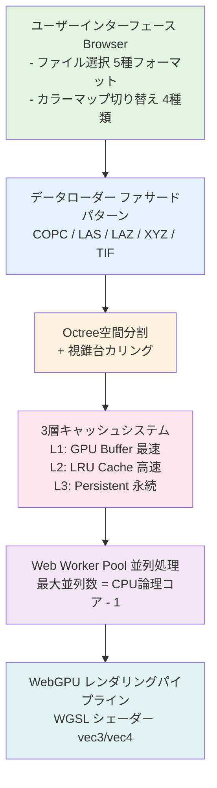
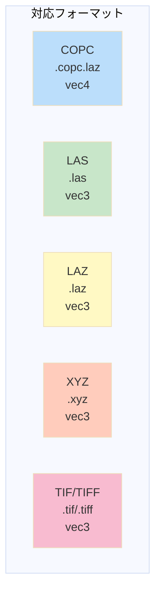
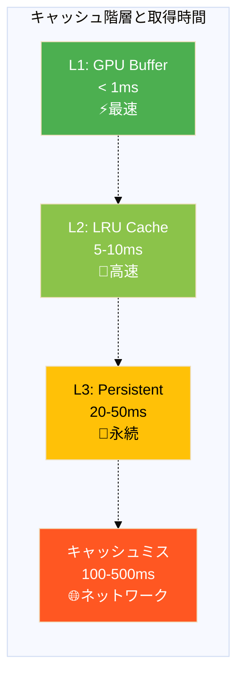
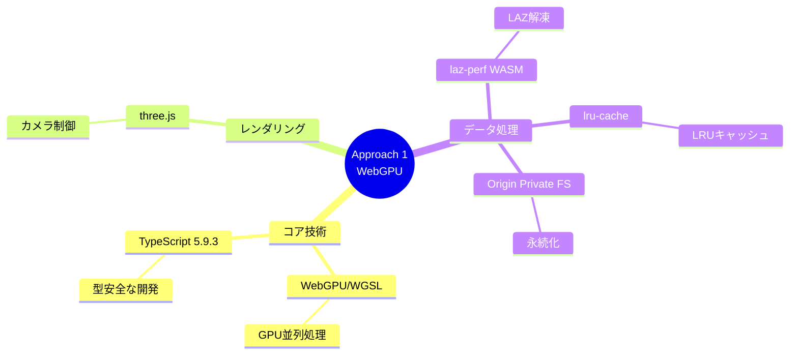
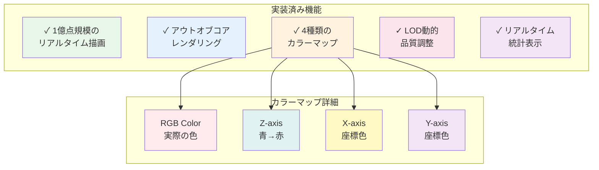
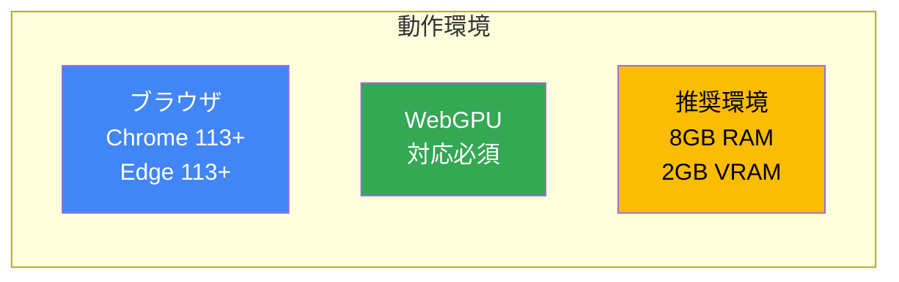

# システムアーキテクチャ図（Mermaid版）

## Approach 1: WebGPU System Architecture

### フロー図



### 対応フォーマット表



---

## パフォーマンス測定結果

### 描画FPSと初期読込時間

```mermaid
%%{init: {'theme':'base', 'themeVariables': {'fontSize':'16px'}}}%%
xychart-beta
    title "パフォーマンス測定結果"
    x-axis [500万点, 1000万点, 5000万点, 1億点]
    y-axis "FPS" 0 --> 70
    bar [60, 58, 55, 52]
```

```mermaid
%%{init: {'theme':'base'}}%%
xychart-beta
    title "初期読込時間（秒）"
    x-axis [500万点, 1000万点, 5000万点, 1億点]
    y-axis "秒" 0 --> 8
    bar [2.3, 1.8, 4.5, 7.2]
```

---

## キャッシュ効率

### キャッシュヒット時の取得時間



**ヒット率**: 85-92%

---

## 技術スタック



---

## 実装済み機能



---

## 動作環境



---

## GitHubでの表示

このMarkdownファイルをGitHubにpushすると、Mermaid図が自動的にレンダリングされます。

## PowerPoint/Keynoteでの使用

1. **Mermaid Live Editor**を使用
   - https://mermaid.live/
   - 上記のコードをコピペ
   - PNG/SVGでエクスポート

2. **VS Code拡張機能**を使用
   - "Markdown Preview Mermaid Support"
   - プレビューからスクリーンショット

3. **コマンドラインツール**
   ```bash
   npm install -g @mermaid-js/mermaid-cli
   mmdc -i diagram.md -o diagram.png
   ```
